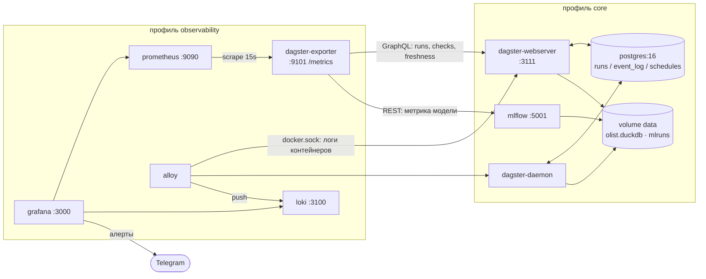

# Observability (черновик для `docs/observability.md`)

Демо 4: пайплайн виден не только в Dagster UI, но и снаружи — в Grafana, и
сообщает о себе сам, в Telegram.

## Схема стека



Что куда течёт:

| Сигнал | Откуда | Как | Куда |
|---|---|---|---|
| Запуски, статусы, длительность | Dagster GraphQL `runsOrError` | экспортер, опрос раз в `POLL_SECONDS` | Prometheus |
| Статус asset checks | `assetNodes → assetChecksOrError → executionForLatestMaterialization` | экспортер | Prometheus |
| Свежесть | `assetNodes → freshnessStatusInfo` | экспортер | Prometheus |
| Метрика модели | MLflow REST `/api/2.0/mlflow/runs/search` | экспортер | Prometheus |
| Логи webserver/daemon | stdout контейнеров, JSON | Alloy `loki.source.docker` | Loki |

## Как поднять

```bash
cp .env.example .env          # заполнить POSTGRES_PASSWORD, GF_SECURITY_ADMIN_PASSWORD
make docker-up                # профиль core: Dagster + MLflow
make docker-up-observability  # core + Grafana/Prometheus/Loki/Alloy/exporter
```

- Dagster UI — <http://localhost:3111>
- MLflow — <http://localhost:5001>
- Grafana — <http://localhost:3000> (логин из `.env`), дашборд «Olist — Dagster & ML» в папке `Olist`
- Prometheus — <http://localhost:9090> (проверка: цель `dagster-exporter` в состоянии UP)

Telegram включается двумя переменными в `.env` — `TG_BOT_TOKEN` и `TG_CHAT_ID`.
В CI они не нужны: тесты алертов ходят в мок, а не в сеть.

## Как сломать check и увидеть алерт

1. `make docker-up-observability`, дождаться зелёного `full_pipeline_job`.
2. Сломать DQ: в `dbt/models/marts/_marts__models.yml` заменить у любого
   `not_null`-теста колонку на заведомо пустую (или в `defs/ml/checks.py`
   поднять порог quality gate выше достигнутой метрики).
3. `dg launch --job dq_job` (или Materialize в UI) → check красный.
4. Через ≤ 1 мин `dagster_asset_check_last_status{...}` = 0, ещё через `for: 1m`
   правило «Dagster — упал asset check» переходит в Firing.
5. Сообщение приходит в Telegram; в панели «Логи Dagster — уровень ERROR»
   видно ту же ошибку строкой.

Быстрее всего на записи ломается **freshness**: у `FreshnessPolicy.time_window`
в демо окна в минутах, достаточно просто не трогать ассет 2–3 минуты.

## «Уровень 0» — алерты без инфраструктуры

Если Grafana избыточна, всё демо 4 сводится к одному сенсору:

```python
@dg.run_failure_sensor(default_status=dg.DefaultSensorStatus.RUNNING)
def alert_on_run_failure(context: dg.RunFailureSensorContext) -> None:
    httpx.post(
        f"https://api.telegram.org/bot{settings.TG_BOT_TOKEN}/sendMessage",
        json={"chat_id": settings.TG_CHAT_ID, "text": f"❌ {context.dagster_run.job_name}"},
        timeout=10,
    )
```

Ноль новых контейнеров, покрывается unit-тестом на мок HTTP. Стоит показать
рядом со стеком: у Grafana-пути есть история, пороги и дедупликация, у сенсора —
пять строк. Выбор зависит от того, нужен ли дашборд вообще.

## dev vs prod: чем отличаются конфиги

| | dev (`dg dev`) | prod (Compose) |
|---|---|---|
| storage | SQLite в `$DAGSTER_HOME` (по умолчанию) | `storage.postgres` через `DAGSTER_PG_*` |
| run_coordinator | Default | `QueuedRunCoordinator`, `max_concurrent_runs: 1` |
| run_launcher | Default | `DefaultRunLauncher` (объявлен явно) |
| формат логов | `colored` | `--log-format json` |
| freshness | `enabled: true` | `enabled: true` |
| telemetry | off | off |

Больше ничего не различается — это и есть тезис для слайда «переезд в прод».

## Риски и что проверить руками

- **Docker в этой сессии недоступен**, поэтому `docker compose config`,
  `alloy fmt` и реальный подъём стека не проверялись. Проверены только синтаксис
  YAML/JSON и компиляция экспортера.
- **MLflow 3.x отбивает чужой `Host`.** В 3.x включена защита от DNS rebinding:
  по умолчанию разрешены только `localhost` и приватные IP, а запрос с
  `Host: mlflow:5001` получает 403. Поэтому в compose задан
  `MLFLOW_SERVER_ALLOWED_HOSTS`. Если экспортер молчит про метрику модели —
  смотреть сюда первым делом.
- **Порог `0.7` в правиле алерта дублирует `MODEL_METRIC_THRESHOLD` из `.env`.**
  Grafana подставляет `${VAR}` только в строковые поля provisioning, а
  `params` у threshold-выражения — число. Менять придётся в двух местах.
- **`chatid` Telegram — отрицательное число.** В provisioning он записан строкой
  в кавычках; если контакт-пойнт не создаётся, проверить это первым.
- **`COMPOSE_PROFILES=core` в `.env`** — удобно, но полагаться на него в
  Makefile не стоит: цели передают профили явным списком.
