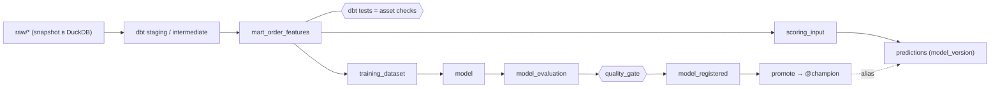

# mlinside-demo-02-dagster

Демо к лекции MLInside «Оркестрация ML-пайплайнов на Dagster» (аудитория — MLE/MLOps, рассказчик — Data
Engineer) на датасете [Olist](https://www.kaggle.com/datasets/olistbr/brazilian-ecommerce).

**Тезис:** Dagster соединяет dbt-модели и ML-артефакты в один asset graph — видно, из чего получена модель,
что проверено и какой версией рассчитаны предсказания.



Ingestion здесь — предпосылка, а не блок демо: данные считаются доставленными DE-командой; для автономности
используется локальный DuckDB со snapshot Olist (`dbt seed`, без сети).

## Быстрый старт

```bash
brew install just            # или: uv tool install rust-just
just install                 # uv sync
just demo-prepare            # raw-snapshot → DuckDB, dbt deps, baseline-версия модели (без алиаса)
just dev                     # Dagster UI: http://127.0.0.1:3000
just --list                  # все рецепты
```

Слайды докладчика (≤30 мин, тайминг, главный поинт, текст, команды, материалы) — [`DEMO.md`](DEMO.md);
план блоков с состоянием «до», действиями, UI и fallback — [`DEMO-plan.md`](DEMO-plan.md).

## Статус

Ревизия плана v3 (2026-09-20) принята; код пишется по шагам [`.claude/TODO.md`](.claude/TODO.md) (M0–M8).
Команды выше появятся по мере шагов M0–M4; до этого репозиторий — документация.

## Навигация

| Документ | Что внутри |
|---|---|
| [`DEMO.md`](DEMO.md) | «виртуальные слайды» докладчика: ⏱ тайминг, заголовок, главный поинт, буллеты, bash + `just`, материалы |
| [`DEMO-plan.md`](DEMO-plan.md) | план блоков: старт / dbt / обучение и gate / promotion и inference / выборочный пересчёт / dev-prod, CI, observability — «до», действия, UI, fallback |
| [`docs/theory/training-in-demo.md`](docs/theory/training-in-demo.md) | теория обучения в демо для DE + 10 проверочных вопросов (самопроверка — скилл `demo-training-selfcheck`) |
| [`docs/overview.md`](docs/overview.md) | что это, ML-задача, граф ассетов, dev vs prod, appendix «как в проде» (обучение, инференс, мониторинг) |
| [`docs/decisions.md`](docs/decisions.md) | ADR-01…ADR-18: ingestion-предпосылка, dbt как ассеты и checks, ML чёрный ящик, register ≠ promote, batch inference, Justfile, выборочный пересчёт |
| [`docs/contracts/`](docs/contracts/) | контракты данных: [`raw.md`](docs/contracts/raw.md), [`features.md`](docs/contracts/features.md) |
| [`docs/runbook.md`](docs/runbook.md) | установка, scaffold, версии, команды, типовые сбои |
| [`docs/estimation.md`](docs/estimation.md) | оценка трудоёмкости и стоимости (по прежнему scope, 2026-09-20) |
| [`.claude/TODO.md`](.claude/TODO.md) | пошаговый план M0–M8 и appendix |
| [`.claude/.archive/`](.claude/.archive/) | прежний план и постановка — архив: факты и разведка, не требования |
| `.claude/drafts/` | исследовательские артефакты лейнов (ingest/dlt, ML, CI, observability) — не код проекта |

## Стек

Python 3.12 · uv · Dagster 1.13 (`dg`, компоненты `defs.yaml`) · dagster-dbt · dbt-core + dbt-duckdb · DuckDB ·
scikit-learn · MLflow (SQLite backend, реестр с алиасами) · Justfile · GitHub Actions. Версии — в `pyproject.toml`
(после M0) и [`docs/runbook.md`](docs/runbook.md).

## Происхождение

Выделен из [dataengy/mlinside-hw-olist](https://github.com/dataengy/mlinside-hw-olist) (`demo/02-dagster`, история
сохранена) и подключён туда git-сабмодулем: `git submodule update --init demo/02-dagster` (без `--recursive`).
dbt-проект — копия канонического `mlinside-hw-olist/dbt` с разрешёнными отличиями (ADR-04).
