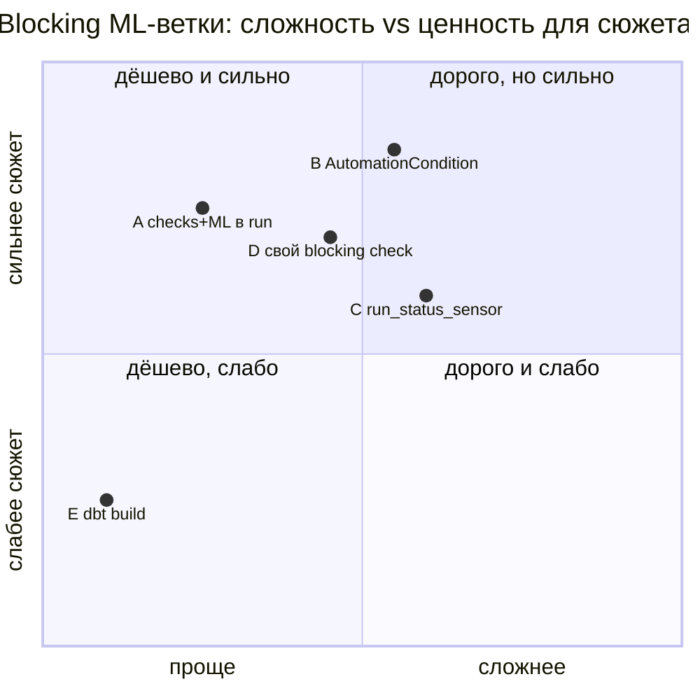
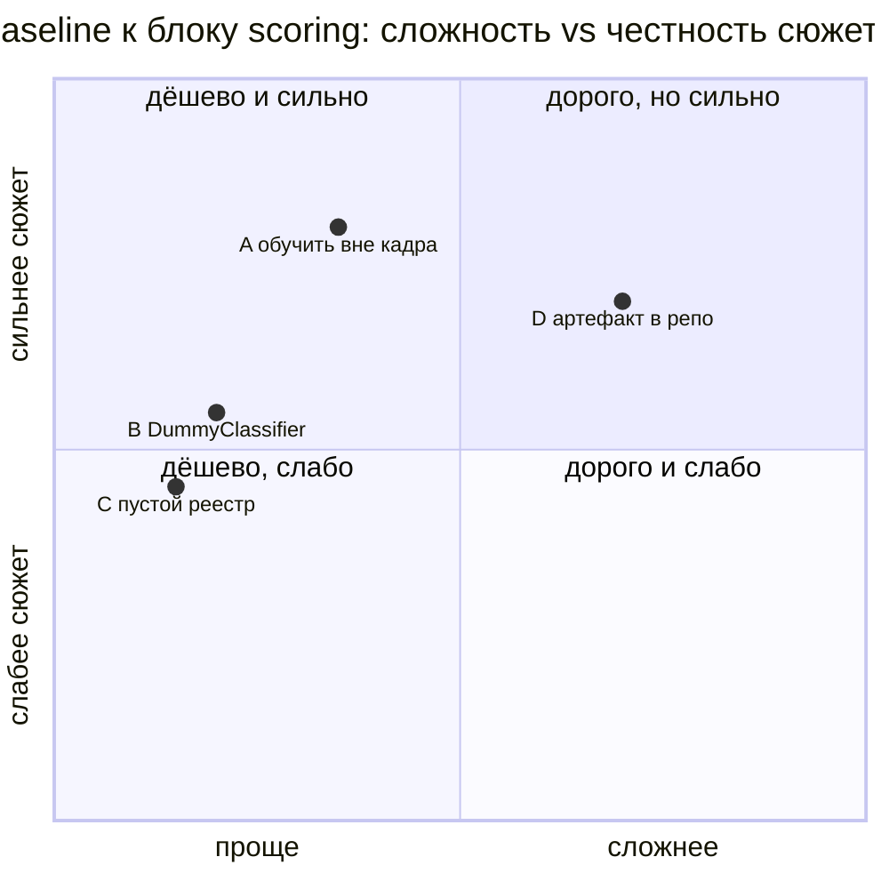

# Решения (ADR) — первая реализация (MVP)

> Формат: контекст → решение → последствия, 5–10 строк на запись. Ссылки вида «PLAN D6» указывают на
> **архивный** план [`.claude/.archive/PLAN.md`](../.claude/.archive/PLAN.md) — это источник ранее измеренных
> фактов и разведки, **не требование**. Целевое состояние и appendix «как в проде» — [`overview.md`](overview.md).
> Пошаговый план — [`.claude/TODO.md`](../.claude/TODO.md). Сценарий показа — [`DEMO.md`](../DEMO.md).
> Статус: **ревизия v3 принята 2026-09-20** (аудитория MLE/MLOps, рассказчик — DE; ≤30 мин экрана).

## Что такое MVP

Сюжет: **готовые raw-таблицы (snapshot Olist в DuckDB) → dbt staging/intermediate → feature mart →
training dataset → обучение как чёрный ящик → evaluation и blocking gate → регистрация кандидата в MLflow →
явный promotion в `champion` → независимый batch inference**. Dagster связывает всё в один наблюдаемый
asset graph. Воспроизводится из чистого клона: `just install && just demo-prepare && just dev`; зелёный
`just test-all`; GitHub Actions. Ingestion, внутренности ML, Docker и observability — предпосылки или appendix,
они не вытесняют главный сюжет (dbt + ML lifecycle в Dagster).

---

## ADR-01. Отдельный репозиторий на демо

**Контекст.** Изначально демо жило в `mlinside-hw-olist/demo/02-dagster`; монорепо `mlinside-demo` давало цикл
сабмодулей hw-olist → demo → hw-olist (PLAN D9, D14).
**Решение.** Демо вынесено в [dataengy/mlinside-demo-02-dagster](https://github.com/dataengy/mlinside-demo-02-dagster)
(история сохранена через `git subtree split`) и подключено в `mlinside-hw-olist` сабмодулем `demo/02-dagster`.
**Последствия.** Все команды — из корня этого репо; CI и issues — здесь; `MLInside-course` подключает ровно
нужные демо. Ловушка вложенных сабмодулей — `git submodule update --init` **без** `--recursive`.

## ADR-02. Раскладка `create-dagster` + YAML-компоненты; python-fallback отложен

**Контекст.** ТЗ требует строго дефолтную структуру `create-dagster project` и компоненты `defs.yaml` как
основной способ интеграций; python-декораторы — только где компонент не покрывает (PLAN D1).
**Решение.** MVP использует только `dg.load_from_defs_folder(...)` из scaffold-`definitions.py`;
интеграции — два `DbtProjectComponent`: `defs/ingest/defs.yaml` (seeds → `raw/*`) и `defs/dbt/defs.yaml`
(модели + checks); ML, jobs, maintenance — обычные python-модули внутри `defs/`, которые
автозагрузка подхватывает без правок `definitions.py`.
**Последствия.** Переключатель `INTEGRATIONS_STYLE=yaml|python` и пакет `integrations_python/`
(PLAN D1) — после лекции; `definitions.py` остаётся нетронутым. Живой scaffold в кадре — во временной папке
или показ уже выполненных команд (§5.1 ревизии), рабочий репозиторий поверх себя не пересоздаётся.

## ADR-03. Ingestion — предпосылка, не демо: `dbt seed` shipped-snapshot + `demo-prepare`; dlt — stretch

**Контекст.** Ревизия v3 (2026-09-20): аудитория — MLE/MLOps, рассказчик — DE; ingestion занимает ≤30 с
экрана. Данные считаются уже доставленными DE-командой или доступными в warehouse/lakehouse; для автономности
демо используется локальный DuckDB со snapshot Olist. Ранее в MVP стоял dlt из Kaggle (разведка в
`.claude/drafts/ingest/`, PLAN D11): анонимная загрузка работает, но требует сети в демо и в CI и второго
компонента ingest → ветвление `definitions.py`.
**Решение.**
- Ingest MVP = `dbt seed` из shipped-snapshot `dbt/seeds/raw/<table>.csv` (8 таблиц, ~5 000 связанных по
  `order_id` заказов, ≈8 МБ; в git — через git-lfs, см. TODO M1). Первый запуск автономный и детерминированный:
  без Kaggle, без сети. Фикстуры тестов (≤500 заказов) — обычные файлы в `tests/fixtures/`.
- Одна команда подготовки — `just demo-prepare`: seeds → `raw.*`, `dbt deps`, локальные зависимости и
  обеспечение baseline-версии модели **без алиаса** (как именно — ADR-07a, открыто). Она **не** обучает кандидата
  в кадре, **не** делает promotion, **не** меняет `champion`.
- `raw/<table>` остаются реальными ingest-ассетами (группа `raw`, отдельный компонент `DbtProjectComponent`
  с `select: "path:seeds/raw"`), но **не входят** в основные demo-джобы (feature mart / DQ / train / promote /
  score). Фиктивных materializations нет.
- **dlt — опциональный stretch** после зелёного основного сюжета, и только если одновременно: ≤1 компонент/модуль
  и ~30 мин агент-времени; ноль правок в dbt, `sources.yml` и ML-коде; без сети в демо и CI; без ветвлений в
  `definitions.py` сложнее одной переменной режима. **Сработавшие критерии «против»:** сеть в демо/CI
  (kagglehub) и второй компонент ingest = выбор модуля в `definitions.py`. Итог: dlt в MVP не входит; в DEMO —
  одна фраза «по dlt и Airbyte будет отдельный вебинар», черновики остаются в appendix.
**Последствия.** `just clean raw` дропает схему `raw` и пересеивает snapshot; смена объёма snapshot — пересборка
seeds скриптом (`scripts/make_seeds_sample.py`, вход — полный датасет вне репо). Контракт raw (ADR-14) делает
замену загрузчика прозрачной для dbt/ML. Альтернатива «данные от другой команды, `raw/*` как внешние
assets/sources» — в appendix DEMO.

## ADR-04. dbt — копия канона, в графе только `+mart_order_features`

**Контекст.** Канонический dbt-проект `mlinside-hw-olist/dbt`: 8 sources, 8 staging, 3 intermediate,
6 marts, 2 справочных seed. Submodule даёт цикл, symlink не переживает клон (PLAN D9). Для демо нужен
минимум узлов, но переписывать модели нельзя.
**Решение.** `scripts/sync_dbt_from_canonical.sh` (rsync + наложение разрешённых отличий, идемпотентно) →
`dbt/`. Разрешённые отличия: `profiles.yml` (только `duck`), `sources.yml` (см. ADR-05),
`macros/generate_schema_name.sql` (схемы без префикса `main_`), `macros/cross_db/date_parts.sql`
(+`month_of`), новая модель `marts/mart_order_features.sql` + её yml (descriptions, owners/tags → в UI).
Компонент `defs/dbt/defs.yaml`: `select: "+mart_order_features"`, `exclude: "path:seeds/raw"` — в граф попадают
8 stg + 3 int + 1 mart (+ справочные seeds), остальные 5 marts остаются в копии, но не в графе; каждая модель —
отдельный ассет, `ref()`/`source()` = рёбра, dbt не превращается в один непрозрачный task.
**dbt-тесты = asset checks, материализация ≠ проверка (§5.3 ревизии):** две отдельные операции —
`feature_mart_job` (только модели до `mart_order_features`) и `dq_job` (только checks; dagster-dbt сам
выставляет `DBT_INDIRECT_SELECTION=empty`). Зелёная модель + красный check — разные состояния в UI.
Провал контракта витрины должен **блокировать ML-ветку** — варианты реализации, SWOT и сравнение ниже
(**решение не принято**, выбор за пользователем). `dbt_build_job` (одна кнопка) остаётся для CI/диагностики,
в кадре не главный.
**Последствия.** Smoke-тест `test_dbt_copy_in_sync` проверяет, что отличий от канона ровно столько;
`mart_order_features` + `month_of()` — кандидаты на PR в канон. Негативный e2e-сценарий «сломанный контракт →
check failed → ML не выполнена» — обязательный тест и блок DEMO. Source freshness (`dbt source freshness`)
— в коде и appendix, отдельного экранного времени не получает (ADR-17 про asset freshness).

### ADR-04a. Как провал dbt-теста останавливает ML-ветку — варианты

> **Решение пользователя (2026-09-20): A + B.** `train_job` включает blocking dbt-checks витрины в один run с
> ML-ассетами (кнопка в кадре гейтится из коробки); на `training_dataset` —
> `AutomationCondition.eager() & all_deps_blocking_checks_passed()` для декларативных запусков. Проверить на M2:
> статус пропущенных ML-ассетов в UI, тик демона для B. Варианты ниже сохранены как обоснование.

**Факты по установленным версиям (сверено по исходникам, 2026-09-20).** dagster-dbt 0.29.23
(`asset_utils.py:829–838`): dbt-тест с `severity: error` (значение по умолчанию) превращается в
`AssetCheckSpec(blocking=True)`; `severity: warn` → non-blocking. Семантика `blocking` в dagster 1.13.23
(`asset_check_spec.py:77–82`): при провале с `ERROR` **downstream-ассеты в том же run не выполняются**; если
результат check не эмитится — downstream идёт с предупреждением. То есть «blocking» работает **внутри одного
run**: `dq_job` (только checks) и отдельный `train_job` (только ML) друг друга не гейтят — нужна связка.
`AutomationCondition.all_deps_blocking_checks_passed()` существует (`automation_condition.py:893`) — гейт для
**декларативных** запусков (эвалюация автоматизации), а не для кнопки Materialize.

| Вариант | Как | Что видно в кадре |
|---|---|---|
| **A. Checks витрины в одном run с ML** | `train_job = define_asset_job(selection=ML \| AssetSelection.checks_for_assets(mart))` — dbt-checks (blocking по умолчанию) выполняются первыми, при провале ML-ассеты пропускаются | один run: красный check → серые ML-ассеты; но `dq_job` отдельно тоже остаётся |
| **B. Декларативная автоматизация** | на `training_dataset`: `AutomationCondition.eager() & all_deps_blocking_checks_passed()`; `dq_job` красный → автозапуск ML не происходит | нужно ждать тика демона; ручной Materialize условие **не** останавливает |
| **C. Сенсор статуса** | `@run_status_sensor(monitored_jobs=[dq_job], run_status=SUCCESS)` → `RunRequest(train_job)`; провал dq → ничего не запускается | «ML запустился, потому что DQ зелёный»; для демо-фейла показать отсутствие запуска |
| **D. Свой контрактный check** | `@asset_check(asset=mart, blocking=True)` на ключевое правило контракта (SQL из `contracts/features.md`), включается в `train_job` как в A | явная «проверка контракта витрины» рядом с dbt-тестами; дублирует dbt |
| **E. `dbt build` одним run** | `feature_mart_job` с `cli_args: [build]` + ML в той же выборке | тест-фейл роняет run вместе с моделью — теряется сюжет «зелёная модель + красный check» |

**SWOT.**

| | A. checks + ML в run | B. AutomationCondition | C. run_status_sensor | D. свой blocking check | E. dbt build |
|---|---|---|---|---|---|
| S | ноль нового кода, blocking из коробки, одна кнопка в кадре | «современный Dagster», условие читается как политика | прозрачная причинность, знакомо Airflow-аудитории | явная семантика «контракт» независимо от dbt | проще некуда |
| W | checks бегут дважды (в `dq_job` и в `train_job`); ⚠ проверить, что `dbt test` внутри run с ML не роняет весь run | не гейтит ручной Materialize; нужен демон и тик (~30 с ожидания) | ещё один объект (сенсор), задержка тика; фейл = «ничего не произошло» — надо объяснять | дублирование правила в двух местах, расхождение при изменении контракта | ломает §5.3 (материализация ≠ проверка) |
| O | показать `AssetSelection` как язык выборок | связка с ADR-17 (выборочный пересчёт тоже через automation) | реплика про Cosmos/Airflow: «сенсор вместо cross-DAG зависимости» | иллюстрация ADR-14 в коде | — |
| T | UI покажет ML как «skipped», а не «blocked» — ⚠ проверить формулировку | демон не включён в dev → «ничего не работает» | flaky при быстром повторном запуске | тест и check разъедутся | аудитория MLE: «а где отдельный DQ?» |

**Сравнение (curve): сложность реализации ↔ честность/ценность для сюжета**

Комбинации: A + B (кнопка в кадре гейтится blocking-check'ом в run, автоматизация — той же политикой) —
наиболее «дагстеровская» пара; A + D — если нужен явный контракт-check помимо dbt. Что проверить на M2 до
выбора: (1) поведение UI в A (статус пропущенных ML-ассетов); (2) для B — тик демона и текст условия в UI;
(3) двойной запуск checks — стоимость < 2 с на snapshot, приемлемо.

## ADR-05. Сшивка графа: ключ dbt-source = ключ ingest-ассета

**Контекст.** Граф должен быть одним связным компонентом от `raw/*` до `predictions`.
**Решение.** В `sources.yml` копии у каждой таблицы `meta: {dagster: {asset_key: [raw, <table>]}}`,
`database: olist`, `schema: raw`, без `external_location`; seed-файлы называются как таблицы
source (`orders`, `order_items`, …) и транслируются в `raw/{{ node.name }}`.
**Последствия.** Переход на любой другой ingest (dlt, внешние assets) не меняет `sources.yml` (ADR-14).
Проверяется smoke-тестом `test_graph_connected` (BFS от `raw/orders` достигает все ключи).

## ADR-06. ML — чёрный ящик: одна детерминированная модель, 8–10 признаков, один blocking gate

**Контекст.** Ревизия v3 §6: рассказчик не преподаёт ML; показываем откуда выборка, какие признаки доступны в
момент предсказания, что проверено, что зарегистрировано, какой версией сделаны predictions. Разведка
(`.claude/drafts/ml/REPORT.md`, архив): задача «заказ будет доставлен позднее обещанного срока», ~6.8 %
положительных; признаки после доставки дают утечку.
**Решение.**
- Формулировка: «На основании информации, доступной при оформлении заказа, оценить риск, что заказ будет
  доставлен позднее обещанного срока». Feature contract — ADR-14.
- **Одна модель**: `LogisticRegression` по умолчанию внутри одного sklearn `Pipeline`
  (`ColumnTransformer`: numeric → impute+scale, categorical → one-hot); preprocessing — часть pipeline,
  fit только на train. Если на shipped-snapshot LogReg не даёт стабильного результата между сидами —
  `HistGradientBoosting`; решение по измерению фиксируется здесь (задача M3). **8–10 признаков**, список
  утверждается на M3 (кандидаты: `items_cnt`, `distinct_sellers_cnt`, `order_value`, `freight_share`,
  `max_installments`, `customer_state`/`customer_region`, `customer_seller_distance_km`,
  `estimated_delivery_span_days`, `purchase_month`, `main_category`).
- **Один blocking gate** — `quality_gate` по ROC AUC на holdout (`@asset_check(blocking=True)` на
  `model_evaluation`). Прочие метрики (PR AUC, accuracy, positive rate) логируются в MLflow, чеками не
  становятся. Порог **не переносится из архива**: измеряется на фактическом snapshot/признаках/сплите
  (5 сидов, порог = минимум − 0.02) и записывается в `.env.example` на M3. Гарантированный fail-сценарий —
  временное повышение порога через run config (`GateConfig.min_roc_auc`) или `.env`, а не «другая, худшая модель».
- Не показываем: устройство алгоритма, гиперпараметры, сравнение моделей, feature importance, графики.
  Метаданные ассетов — числа + ссылка на MLflow run.
- Сплит — детерминированный, в Python по `md5(order_id|split|seed)`; random split — учебное упрощение,
  temporal split — appendix (overview §6.2). `training_dataset` **сохраняет snapshot train/holdout**
  (`data/ml/train_<fingerprint>.parquet`, `holdout_…`); `model_evaluation` читает holdout-снапшот, а не
  перечитывает витрину (§6.5 ревизии).
**Последствия.** Единственная ML-остановка в кадре — утечка: `delivery_delay_days` даёт почти идеальную метрику,
но недоступен в момент scoring → его нет в контракте. Конкретный AUC в docs не обещаем до воспроизведения
на текущем коде. `purchase_month` как признак — оговорка «память об инцидентах» остаётся, если признак войдёт в
список.

## ADR-07. Свой `MlflowResource`; регистрация ≠ promotion; идемпотентность по `dataset_fingerprint`

**Контекст.** `dagster-mlflow` — op-ориентированный legacy (`mlflow_tracking` + хук), не ложится на ассеты
(PLAN D5). Ревизия v3 §7.1: register и promote — разные шаги; после failed gate предыдущий `champion` не меняется;
«последняя версия = production» недопустимо. Повторный запуск не должен плодить версии.
**Решение.** `MlflowResource(dg.ConfigurableResource)` — тонкая обёртка: `setup()` (tracking/registry URI,
эксперимент), `run_url()`. Backend `sqlite:///data/mlflow.db`, артефакты `data/mlruns`, UI — `just mlflow`
на порту **5001** (5000 на macOS занят AirPlay). Цепочка: `model` (кандидат, MLflow run) → `model_evaluation`
→ `quality_gate` (blocking) → `model_registered` — создаёт **версию без алиаса** (тег `dataset_fingerprint =
md5(sorted order_id + params)`; совпал с существующей версией → новая не создаётся, `reused_existing=True`)
→ **отдельная джоба `promote_job`** (`@op`, единственное место кроме maintenance) переводит алиас `champion`
на указанную/последнюю прошедшую gate версию — явное действие в кадре или из CLI. К блоку scoring реестр не
должен быть пуст — как обеспечить baseline-версию, см. ADR-07a (**решение не принято**).
**Последствия.** Failed gate → версии нет, `champion` прежний, scoring продолжает использовать прежнюю
опубликованную версию. Откат = перевод алиаса на прошлую версию. `models:/<name>@champion` — контракт для
inference (ADR-13).

### ADR-07a. Baseline-версия к блоку scoring — варианты

> **Решение пользователя (2026-09-20): A.** `demo-prepare` обучает ту же модель вне кадра на том же snapshot и
> регистрирует v1 **без алиаса** (тег `baseline=true`, другой `RANDOM_STATE`/параметр, чтобы fingerprint не
> совпал с кандидатом из кадра). Оговорка в DEMO S0: «baseline, не кандидат; promotion остаётся живым действием».
> Варианты ниже сохранены как обоснование.

**Зачем.** В блоке 4 DEMO нужно показать (а) promotion как живое действие и (б) что failed gate не трогает
`champion`, а scoring продолжает работать прежней версией. Для (б) в реестре к началу блока должна быть хотя бы
одна версия, **не** созданная в кадре. Ревизия §7.1 предлагает: `demo-prepare` регистрирует baseline **без
алиаса**. Нюанс: любая «настоящая» версия требует обучения — пусть и вне кадра.

| Вариант | Как | Обучение? |
|---|---|---|
| **A. `demo-prepare` обучает ту же модель вне кадра** | тот же `train_job` на том же snapshot → v1 без алиаса; в кадре `train` даёт v2 (или `reused_existing`, если fingerprint совпал — нужен другой параметр/сид для baseline) | да, вне кадра (~секунды) |
| **B. Заглушка-baseline** | `DummyClassifier(strategy="prior")` в том же Pipeline-контракте → v1 без алиаса; честно помечена тегом `baseline=dummy` | нет (fit тривиален) |
| **C. Пустой реестр, promote в кадре первым** | блок 4 начинается с promote v1 из блока 3; сценарий «failed gate не трогает champion» показывается **после** — второй train с поднятым порогом | нет подготовки; +1 мин в кадре |
| **D. Заранее обученная версия в артефактах репо** | `data/mlflow.db` + `mlruns/` для baseline коммитятся (или восстанавливаются скриптом из parquet-снапшота); `demo-prepare` только копирует | нет при подготовке; да — при сборке артефакта |

**SWOT.**

| | A. обучить вне кадра | B. DummyClassifier | C. пустой реестр | D. артефакт в репо |
|---|---|---|---|---|
| S | реалистичный реестр (две «настоящие» версии), нет спецкода | ноль обучения, мгновенно, честная маркировка | ничего не прячем, всё в кадре | детерминизм байт-в-байт, быстрый старт |
| W | `demo-prepare` «всё-таки обучает» (расхождение с §4.6 «не обучает» — нужна оговорка «baseline, не кандидат»); риск `reused_existing` | scoring прежней версией даёт константные скоры — реплика «прежняя модель была слабой» | ломает тайминг (+1 мин), сценарий (б) становится длинным | бинарные артефакты в git/LFS, привязка к версиям mlflow/sklearn |
| O | второй параметр/сид → видна разница версий в MLflow | показать, что реестр хранит и заглушки — «версия ≠ качество» | максимальная прозрачность для MLE | воспроизводимость записи |
| T | время подготовки растёт; вопрос «чем baseline отличается» | аудитория: «это же не модель» | не помещается в 30 мин | сломанный unpickle при апгрейде зависимостей |

Что уточнить перед выбором: допускается ли обучение внутри `demo-prepare` при явной оговорке «baseline, не
кандидат, без алиаса» (A), или требование «не обучает» жёсткое (тогда B или C). Теория по теме —
[`theory/training-in-demo.md`](theory/training-in-demo.md) §6.

## ADR-08. DuckDB — единственное хранилище; `in_process_executor`

**Контекст.** DuckDB допускает одного писателя на файл (PLAN D7).
**Решение.** Один файл `data/olist.duckdb` для raw/staging/intermediate/marts; `executor=in_process_executor`
объявлен один раз в `defs/executor.py`; в compose дополнительно `max_concurrent_runs: 1`.
**Последствия.** Параллелизма внутри run нет — для демо это не важно; в prod — ClickHouse + `multiprocess`
(overview §4). `DuckDBResource.connect(read_only=True)` для чтения в ML-ассетах.

## ADR-09. Никаких скаляров в коде; плоский `.env.example`

**Контекст.** Правило ТЗ: хосты, порты, пути, пороги, `sample_frac`, имена экспериментов — только через
`settings.py` (pydantic-settings). Глобальная конвенция `~/.claude/CLAUDE.md` предлагает
`config/*.template` + `.env-render.sh`.
**Решение.** `src/olist_ml/settings.py` — единственное место констант; составные значения
(`DAGSTER_UI_URL`, `MLFLOW_TRACKING_URI`, `DUCKDB_CATALOG`) — `computed_field`. `.env.example` —
плоский `KEY=value` с комментариями, секреты пустые; Makefile делает `-include .env` + `export`.
Тест `test_settings.py` проверяет, что каждый ключ `.env.example` — поле `Settings`, а дефолты совпадают.
**Последствия.** ⚠️ Отступление от глобальной конвенции `config/`: в демо один файл `.env` понятнее аудитории;
`config/`-раскладка не вводится. Правило `${VAR:-fallback}` не нарушается — литералов в шаблоне нет,
кроме дефолтов, которые и есть значения `Settings`.

## ADR-10. Три уровня очистки: `raw` / `derived` / `all`

**Контекст.** Требование пользователя: полная очистка данных из раннера с двумя опциями — «всё кроме
raw/source» и «только raw/source, чтобы пересеять snapshot». ТЗ п. 6 требует джобы очистки в
`defs/maintenance/` (единственное законное место `@op`/`@job`).
**Решение.**
| Джоба | Рецепт | Что удаляет |
|---|---|---|
| `clean_raw_job` | `just clean raw` | схема `raw` в DuckDB (seeds пересеиваются `demo-prepare`) |
| `clean_derived_job` | `just clean derived` | схемы `staging`/`intermediate`/`marts`/`seeds`/`ml` в DuckDB, `data/ml/*.parquet`, `dbt/target/`, эксперимент и registered model в MLflow, `data/mlruns/` |
| `clean_all_job` | `just clean all` | `clean_raw_job` + `clean_derived_job` |
| — | `just clean-build` | только кеши сборки (`__pycache__`, `.pytest_cache`, `dbt/target`, `dbt/dbt_packages`) — данные не трогает |
Каждая джоба идемпотентна: на пустом состоянии — успех. Рецепты зовут `uv run dg launch --job <name>`
(флаг `--job` есть в dagster-dg-cli 1.13.23, сверено по `cli/launch.py`).
**Последствия.** Демо «с нуля» = `just clean all && just demo-prepare`; `just clean raw` = пересев snapshot.
Отдельные `clean_dbt`/`clean_ml` — не нужны.

## ADR-11. CI = вызовы рецептов раннера

**Контекст.** Ревизия §9: ~1 мин в кадре — зелёный пайплайн и что он проверяет; без сети за данными (shipped
fixtures), без логики в YAML, без секретов; e2e отделён от быстрых проверок.
**Решение.** Job `ci` (`ubuntu-latest`, Python 3.12, `astral-sh/setup-uv` с кешем, `extractions/setup-just`):
`just install`, `just check`, `just test`; job `e2e` (`needs: ci`, не на PR): `just test-e2e`. `just check` =
`dg check defs` + `ruff check` + `dbt parse`. Черновик workflow — `.claude/drafts/ci/.github/workflows/ci.yml`
(цели переименовать).
**Последствия.** Всё, что зелёное в CI, повторяется локально `just ci`; ни одна показываемая команда не
существует только в слайдах. Docker-образ в CI не собирается; деплой и Dagster+ — docs, не кадр.

## ADR-12. Docker Compose и Grafana-стек — вне MVP (docs и расширенное демо)

**Контекст.** Ревизия §10: observability ~1.5 мин, полный стек в кадре не разворачивается, если это дольше одной
команды или 30 с ожидания; §6 приоритетов: Docker не вытесняет главный сюжет. Решение пользователя (2026-09-20):
в коде MVP — только Telegram-алерт (ADR-18); Compose `core` и Grafana — не в MVP.
**Решение.** Черновики `.claude/drafts/observability/` (compose с профилями `core`/`observability`, Postgres,
экспортер, Grafana provisioning) остаются как основа **расширенного демо** и `docs/deploy/`, `docs/observability.md`
(пишутся после MVP). Ранее принятое правило «Dagster storage в compose — Postgres» (PLAN D8: SQLite на общей volume
даёт `database is locked`) сохраняется для расширенного демо.
**Последствия.** В MVP `dagster.yaml` только dev (SQLite в `DAGSTER_HOME`, `freshness.enabled: true`). Dev vs prod
объясняется через ML-процесс (overview §4.1), не через инфраструктуру.

## ADR-13. Обучение и инференс — разные контуры; в MVP — минимальный непартиционированный batch inference

**Контекст.** В проде обучение (периодическое) и применение модели (постоянное, batch или online) живут
раздельно и связаны через реестр моделей; несоответствие между ними — *training-serving skew*. Ревизия §7.3
требует показать независимый batch scoring в MVP. Подробно про прод — [`overview.md` §6](overview.md)
(appendix: контуры A/B/C, типичные ошибки §6.6).
**Решение.** Инференс в MVP — два ассета: `scoring_input` (строки из feature mart с **ещё неизвестным** target,
не «уже доставленные заказы»; см. ADR-14) → `predictions`. `predictions`: один раз в начале run разрешает
`champion` в конкретную версию, загружает **полный Pipeline** (preprocessing внутри), считает `score` и
`predicted_class` для фиксированного batch, пишет `order_id, score, predicted_class, model_version, batch_id,
scored_at` в `ml.predictions`; повторный запуск того же `batch_id` не создаёт дублей (`delete where batch_id` +
`insert`); обучение не запускает; при отсутствии `champion` завершается понятной ошибкой «нет опубликованной
модели — выполните promote». Metadata: rows, mean score, predicted-positive rate, model version, batch id —
**не** доказательство drift или качества. Без партиций, без `SIM_TODAY`.
Связь train ↔ inference: «прямой runtime-зависимости нет: опубликованная модель передаётся через MLflow alias
`champion`; feature schema и preprocessing остаются общим контрактом» (не «только через alias»).
**Последствия.** Реплика в кадре: «scoring работает, и видно, какой версией получены предсказания; реальное
качество станет известно позже, когда придут labels». Партиции, backfill, `prediction_monitoring`, drift,
поздние метки, auto-retraining, challenger/champion, online serving — appendix (overview §6, §6.7), не в коде MVP.

---

## ADR-14. Контракты данных: raw и feature contract

**Контекст.** Ревизия §4.2 и §6.3: контракт raw — не только `AssetKey`; переключение источника не должно
требовать правок dbt/ML; нужно различать feature mart / training dataset / scoring input / predictions.
**Решение.** Два документа: [`contracts/raw.md`](contracts/raw.md) — для каждой из 8 таблиц: ключ
`raw/<table>`, `database.schema.table`, колонки и типы (raw грузится `VARCHAR`, касты в staging), ключи и
гранулярность, NULL/`''`-семантика, смысл полей, соответствие `sources.yml`; [`contracts/features.md`](contracts/features.md)
— `mart_order_features` (одна строка на заказ; только признаки, доступные в момент оформления; target
`is_late_delivery` NULL, пока заказ не доставлен), `training_dataset` (исторические строки с известным target,
snapshot train/holdout), `scoring_input` (строки с неизвестным target), `predictions` (результат опубликованной
модели, с `model_version`). Проверка контракта raw — smoke-тест по `sources.yml` + `information_schema` DuckDB
(seed-режим); при появлении второго загрузчика — тот же тест на обоих режимах (appendix).
**Последствия.** Утечка (`delivery_delay_days`, `order_delivered_*`, `review_*`, `order_status`) исключена
контрактом, а не кодом модели. Разделение mart/training/scoring — три отдельных ассета в графе.

## ADR-15. Task runner — Justfile (единственный интерфейс)

**Контекст.** Ревизия §12; факты на 2026-09-20: `just 1.58.0` установлен, системный `make` — GNU 3.81 (без
`.ONESHELL`: многострочные рецепты только через `\`/`;`), нет параметров задач, `-include .env` требует `export`.
**Решение.** `Justfile`: shebang-рецепты (`#!/usr/bin/env bash`/python) без `\`, параметры (`just clean
raw|derived|all`), `set dotenv-load`, `just --list` как help; CI (`extractions/setup-just`) и Docker (`uv tool
install rust-just`) вызывают те же рецепты; README — одна строка установки (`brew install just` / `uv tool install
rust-just`). Makefile не ведётся (один интерфейс). Черновик `.claude/drafts/ci/Makefile` мигрируется на M0.
**Последствия.** Зрителю нужен `just`; компенсация — строка в README и `just --list` в первом кадре.

## ADR-16. Evidently — не в MVP

**Контекст.** Ревизия §7.5 допускала один HTML-отчёт; пакет нигде не установлен, тянет тяжёлые зависимости
(~+150 МБ, сеть). Решение пользователя 2026-09-20 — в расширенное демо.
**Решение.** В MVP Evidently нет; в DEMO (блок observability) — одна фраза + appendix «drift/quality-отчёты».
**Последствия.** Освобождённые ~0.7 мин экрана — резерв тайминга.

## ADR-17. Выборочный пересчёт и freshness — центральный Dagster-сценарий

**Контекст.** Ревизия §8, §5.5. Факт по установленному dagster-dbt 0.29.23: `code_version` dbt-ассета по умолчанию
= `sha1(raw_sql)` (`asset_utils.py::default_code_version_fn`) — своей реализации версионирования не требуется.
**Решение.** Сценарий: изменить SQL `mart_order_features` → reload definitions (manifest пересобирается через
`prepare_if_dev`) → в UI изменённый dbt-ассет получает статус «code version changed» → выбрать mart + downstream
ML-ветку → Materialize selection → по run events: raw и неизменившийся staging не запускались, выполнились витрина
и выбранные потребители. **Не обещаем**: транзитивную пометку downstream сразу после reload; что статический job
сам выберет только Unsynced; что «пересчитается ровно N узлов». Поведение статусов downstream до/после
материализации mart и текст UI **проверяются на 1.13.23 на M5** и дописываются сюда и в DEMO.
Freshness: различаем **asset freshness** (когда ассет последний раз материализован — `FreshnessPolicy.time_window`
на `mart_order_features`, демон `freshness.enabled: true`) и **data/source freshness** (свежесть бизнес-данных —
`dbt source freshness`, в коде и appendix). Недавняя материализация ≠ свежие данные — проговаривается.
**Последствия.** Сравнение с Airflow 3 + Cosmos — только короткими репликами в DEMO (ассеты и lineage вместо
тасков; тесты как checks; один граф через границу dbt → Python; выборочный пересчёт; freshness как статус),
формулировки без преувеличения ограничений Cosmos.

## ADR-18. Observability MVP = Dagster UI + `run_failure_sensor → Telegram`

**Контекст.** Ревизия §10: один экран, один канал алерта, ~1.5 мин. Решение пользователя 2026-09-20.
**Решение.** Статус run'ов и checks — Dagster UI (Runs, Asset checks, Freshness). Один канал алерта —
`@dg.run_failure_sensor` → `httpx.post` в Telegram Bot API (`TG_BOT_TOKEN`/`TG_CHAT_ID` из `.env`, dry-run при
`ALERTS_ENABLED=false`), unit-тест на мок HTTP. Grafana/Prometheus/Loki — расширенное демо (ADR-12).
**Последствия.** Никаких новых сервисов в MVP; в кадре — сообщение в Telegram после сломанного check/run.

---

## Отложено (не в MVP) — appendix

| Тема | Источник | Куда |
|---|---|---|
| dlt из Kaggle (критерии ADR-03), Airbyte | архив D11, `.claude/drafts/ingest/` | appendix DEMO, отдельный вебинар |
| Evidently-отчёт | ADR-16 | расширенное демо |
| Docker Compose core, Grafana-стек, экспортер | ADR-12, `.claude/drafts/observability/` | `docs/deploy/`, `docs/observability.md`, расширенное демо |
| Партиции `predictions`, backfill, `SIM_TODAY`, `prediction_monitoring`, drift, поздние метки, auto-retraining, challenger/champion, online serving, feature store, Kafka | overview §6, §6.7 | appendix |
| `dbt source freshness` как asset checks; `INTEGRATIONS_STYLE=python`, `integrations_python/` | архив D1, D4 | код без экранного времени / после лекции |
| `docs/deploy/` (Hetzner VM, Dagster+) | архив §11 | docs, не кадр |
| Agentic BRD-watch | архив D13 | после лекции |
