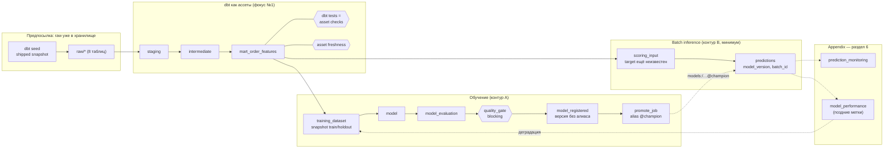

# mlinside-demo-02-dagster — описание проекта

> Статус: описание целевого состояния (ревизия v3, 2026-09-20). Шаги — [`.claude/TODO.md`](../.claude/TODO.md),
> решения — [`decisions.md`](decisions.md), сценарий показа — [`DEMO.md`](../DEMO.md). Раздел 6 — **appendix**:
> как обучение/инференс устроены в проде; в код MVP из него входит только минимальный batch inference (§7.3
> ревизии). Прежний план и постановка — архив [`.claude/.archive/`](../.claude/.archive/), не требования.

## 1. Что это

Демо-проект к лекции MLInside «Оркестрация ML-пайплайнов на Dagster» (дека
`MLInside-course/data/shared/Оркестрация_ML_пайплайнов_на_Dagster_v2.pptx`). Показывает один граф ассетов Dagster
от выгрузки сырых данных до модели в реестре MLflow. Аудитория — MLE и MLOps.

Центральная идея лекции (слайды 3–4, 37, 50): сейчас пайплайн живёт в трёх местах — dbt в CI, ноутбук, cron.
Общего графа нет ни у одного из них. Dagster становится control plane над стеком. Он ничего не вычисляет сам,
но знает, **что существует, из чего получено, когда пересчитать и что проверить**. Трансформации делает dbt,
обучение — sklearn, эксперименты и версии моделей хранит MLflow.

## 2. ML-задача

Датасет — [Olist Brazilian E-Commerce](https://www.kaggle.com/datasets/olistbr/brazilian-ecommerce), 99 441 заказ
за период 2016-09 … 2018-10.

| | |
|---|---|
| Задача | бинарная классификация: «доставленный заказ опоздает» (`is_late_delivery`) |
| Баланс | 6.8 % положительных (среди 96 476 доставленных заказов) |
| Формулировка | «На основании информации, доступной при оформлении заказа, оценить риск, что заказ будет доставлен позднее обещанного срока» |
| Витрина | dbt-модель `mart_order_features`: одна строка на заказ, только признаки, **известные в момент оформления** ([контракт](contracts/features.md)) |
| Модель | одна детерминированная: `LogisticRegression` в sklearn `Pipeline` с preprocessing внутри, 8–10 признаков; ML — чёрный ящик (ADR-06) |
| Метрики | ROC AUC на holdout — единственный blocking gate; остальное логируется в MLflow, чеками не становится |
| Гейт | блокирующий `@asset_check` `quality_gate` на `model_evaluation`; порог измеряется на shipped-snapshot, в docs заранее не обещается |
| Утечка | `delivery_delay_days`, `order_delivered_*`, `review_*`, `order_status` — известны только после доставки → не входят в контракт; единственная «ML-остановка» в кадре |

Разведка по данным (дрейф доли просрочек по месяцам от 0.7 % до 19 %, вклад `purchase_month`) —
[`.claude/drafts/ml/REPORT.md`](../.claude/drafts/ml/REPORT.md) (архивные измерения на полном датасете).

## 3. Граф ассетов

Сплошное — код MVP. Пунктир — appendix (раздел 6), в коде MVP отсутствует.

## 4. Стек: dev и prod

Код ассетов в dev и prod один и тот же. Отличаются ресурсы, `dagster.yaml` и `.env`.

| Слой | dev (ноутбук, демо) | prod |
|---|---|---|
| Хранилище данных | DuckDB-файл | ClickHouse: dbt-таргет `ch`, `ch_table_config` уже есть в каноническом dbt-проекте |
| dbt | `dbt-duckdb` | `dbt-clickhouse`; cross-db макросы через `dispatch` |
| Состояние Dagster | SQLite в `DAGSTER_HOME` (`dg dev`) | Postgres, отдельные webserver и daemon, code location (D8) |
| Executor | `in_process` (DuckDB допускает одного писателя, D7) | `multiprocess` / `k8s`, тяжёлое обучение — через Dagster Pipes |
| MLflow | `sqlite:///mlflow.db` + `./mlruns` | Postgres backend + S3/MinIO для артефактов |
| Observability | лог `dg dev` | Prometheus + Loki + Grafana; алерты в Telegram (демо 4) |
| Деплой | `just dev` | Docker Compose на VM или Dagster+ (Hybrid/Serverless), `docs/deploy/` (после MVP) |

### 4.1. Dev vs prod через ML-процесс, а не через загрузчики

В кадре dev/prod объясняется по осям ML-процесса (§11 ревизии), инфраструктурная таблица выше — справочно:

| Ось | dev (демо) | prod |
|---|---|---|
| Изоляция данных и реестра | небольшой snapshot, отдельный MLflow-эксперимент и реестр в `data/` | утверждённые данные, общий реестр, отдельные ресурсы |
| Объём и окно обучения | весь snapshot | окно партиций (например, скользящие 12 мес.) |
| Проверка кандидата и promotion | gate по порогу, promote вручную в кадре | gate + сравнение с текущим `champion`, promote отдельным шагом/approve |
| Расписания train и scoring | запуск руками | независимые: train — неделя/месяц, scoring — час/день |
| Состояние Dagster | SQLite в `DAGSTER_HOME` | Postgres, отдельные webserver/daemon |
| Executor | `in_process` (один писатель DuckDB) | `multiprocess`/k8s, тяжёлое обучение через Pipes |

Реплика: «В разработке проверяем весь путь на небольшом snapshot и пишем в отдельный эксперимент. В проде
используем утверждённые данные и ресурсы, проверяем кандидата и отдельно допускаем его к применению. Инференс
использует опубликованную версию — обучение при этом не запускается». Оговорка: dev-прогон отвечает на вопрос
«пайплайн работает», а не «модель хорошая».

## 5. Сюжет демо (≤30 минут)

Ingestion — предпосылка, не блок: «данные уже доставлены DE-командой или доступны в warehouse; для автономности
здесь локальный DuckDB со snapshot Olist» (≤30 с). Главный тезис: **Dagster соединяет dbt-модели и ML-артефакты
в один asset graph: видно, из чего получена модель, что проверено и какой версией рассчитаны предсказания.**

| Блок | Мин | Что показываем | Главный результат |
|---|---|---|---|
| Старт | 3 | `just --list`, `dg dev`, подключение dbt-проекта компонентом, роль `manifest.json` | пустой проект → граф dbt в UI |
| dbt | 10 | модели = ассеты, `ref()`/`source()` = рёбра, descriptions/owners в UI; тесты = checks; зелёная модель + красный check; blocking останавливает ML; asset freshness ≠ data freshness | видно, что упало: модель или контракт |
| Feature contract → обучение → gate → registry | 7 | mart / training_dataset / scoring_input; утечка как единственная ML-остановка; train → evaluation → blocking gate → версия без алиаса | версия в MLflow, gate падает по поднятому порогу |
| Promotion → batch inference | 4 | `promote_job` → `@champion`; `scoring_input → predictions` с `model_version`; failed gate не трогает champion | predictions с версией модели |
| Выборочный пересчёт | 3 | правка SQL витрины → статус ассета → материализация только выбранной ветки | raw и staging не запускались |
| Dev-prod, CI/CD, observability | 3 | оси §4.1; зелёный Actions и что он проверяет; Runs/Checks в UI; алерт в Telegram | ломаем check — приходит алерт |

Подробно, с состоянием «до», действиями, fallback и репликами (в т.ч. короткие сравнения с Airflow 3 + Cosmos) —
[`DEMO.md`](../DEMO.md). Инструменты курса вокруг проекта (Feast, DVC, FastAPI-serving, Kafka, Evidently) в демо
намеренно отсутствуют — лекция про оркестрацию; раздел 6 показывает, где они подключаются.

## 6. Appendix. Периодическое обучение и постоянный инференс: как это обычно устроено

### 6.1. Три контура с разной частотой

В проде в Dagster обычно живут три контура. Они связаны через **данные и реестр моделей**, а не одним
расписанием:

| Контур | Частота | Что делает | Триггер в Dagster |
|---|---|---|---|
| **A. Обучение** | неделя или месяц | собрать выборку за окно → обучить → сравнить с текущим champion → зарегистрировать | `AutomationCondition.on_cron(...)` на `training_dataset` и ниже, плюс сенсор деградации (контур C) |
| **B. Инференс** | час или день (batch), либо онлайн | скоринг новых строк текущим `@champion` | партиционированный ассет `predictions` + `on_cron`/`eager`, либо сенсор на landing-зону |
| **C. Мониторинг** | день | дрейф признаков и предсказаний; качество, когда появились метки | ассеты-мониторы + asset checks → алерты; при деградации запускается контур A |

dbt-часть работает по своему расписанию (или `eager` от ingest). Все три контура читают одни и те же витрины.

### 6.2. Контур A — обучение

- **Окно, а не «вся таблица».** Обучающая выборка — диапазон партиций. Например, скользящие 12 месяцев
  (слайд 28: «на каких данных обучена модель»). Границы окна пишутся в теги MLflow-run и в метаданные ассета.
- **Сплит по времени.** Для временных данных holdout берут из последних периодов. Сплит по хешу, как в демо,
  завышает метрику (0.78 против 0.71 на Olist). В демо хеш-сплит оставляем ради наглядности, но
  фиксируем это в `decisions.md`, а в проде переключаем через `TrainConfig`.
- **Challenger против champion.** Новая модель не становится champion только потому, что она новее.
  `model_evaluation` считает метрики нового кандидата **и текущего `@champion` на одном и том же holdout**.
  Блокирующий гейт проверяет два условия: абсолютный порог и отсутствие регрессии относительно champion.
- **Регистрация и промоушен — разные шаги.** `model_registered` создаёт версию с алиасом `@challenger`.
  Перевод алиаса на `@champion` делается автоматически после гейта или вручную из UI (отдельная джоба `promote`).
  Откат = перевод алиаса на прошлую версию, переобучать ничего не нужно.
- **Воспроизводимость.** В тегах run'а хранятся `dataset_fingerprint` (уже в плане, D5), окно данных, git sha
  и хеш dbt-манифеста.
- **Идемпотентность.** Если fingerprint не изменился, новая версия не регистрируется (D5).
- **Тяжёлое обучение** выносится через Dagster Pipes (K8s, Spark, SageMaker). Граф остаётся в Dagster (слайд 38).

### 6.3. Контур B — инференс

**Batch — основной вариант для этого стека:**

- `predictions` партиционирован по дню покупки (`DailyPartitionsDefinition`). Одна партиция — это заказы за день,
  их признаки читаются из `mart_order_features` (или из отдельной inference-витрины без таргета).
- Модель загружается **по алиасу в момент запуска**: `mlflow.pyfunc.load_model("models:/<name>@champion")`.
  Прямой зависимости от ассета `model` в данных нет. В каждой строке результата и в метаданных партиции
  пишется `model_version`, поэтому видно, какая версия что посчитала.
- Запись идемпотентна на уровне партиции. DuckDB: `delete where day = ?` + `insert`. ClickHouse: таблица
  `PARTITION BY toYYYYMM(day)`, `ReplacingMergeTree(scored_at)` по `(order_id, model_version)` или
  `REPLACE PARTITION` из staging-таблицы. Повторный запуск партиции не создаёт дублей.
- Триггер: `AutomationCondition.eager()` (последняя партиция пересчитывается, когда обновилась её партиция в витрине)
  или `on_cron("0 * * * *")` для почасового микро-батча. Если данные приходят файлами — сенсор с курсором
  (слайд 32), который запускает ingest, а дальше цепочку ведёт `eager`.
- **Пересчёт истории после смены модели — осознанное действие.** Это бэкфилл по партициям из UI, а не побочный
  эффект переобучения. Поэтому обновление модели не должно автоматически инвалидировать все партиции `predictions`.
- Результаты лежат в той же БД, что и витрины. Дальше на них строятся dbt-модели, дашборды и мониторинг.

**Онлайн** (ответ нужен за миллисекунды, при оформлении заказа):

- Сервинг вне Dagster: FastAPI или BentoML, модель загружается по тому же алиасу `@champion` при старте
  или при смене алиаса. Признаки берутся из online store (Feast + Redis) или считаются в запросе.
- Dagster отвечает за всё, что вокруг: переобучение, промоушен, материализацию offline- и online-признаков,
  а также разбор логов инференса. Логи идут по цепочке Kafka → ClickHouse, ClickHouse читается ассетом-монитором.
- Стриминговый скоринг с задержкой меньше минуты — тоже не задача Dagster. Минимальная реальная частота
  у него — минуты.

### 6.4. Контур C — мониторинг и обратная связь

- **Дрейф без меток** (ежедневно): PSI или KS по признакам и по распределению скоров, positive rate
  предсказаний. Считается SQL-запросом по ClickHouse или через Evidently. Результат — asset checks на
  `predictions` (WARN или ERROR), они видны в UI и в Grafana.
- **Качество с поздними метками.** Опоздание становится известно только после обещанной даты доставки.
  `model_performance` партиционирован по дню покупки и материализуется с лагом, например через N дней:
  `on_cron` плюс сдвиг окна через `TimeWindowPartitionMapping(start_offset=-N, end_offset=-N)`. Он сопоставляет
  `predictions` с фактом и считает ROC AUC и PR AUC по дням.
- **Замыкание цикла.** Если check на `model_performance` падает, сенсор (`@asset_check`-статус или
  `run_status_sensor`) запускает контур A вне расписания. Итоговое правило переобучения:
  «по расписанию **или** по деградации, но не чаще X».

### 6.5. Как это ложится на Olist

Датасет исторический: новые заказы не приходят. Поток имитируется «виртуальным сегодня»:

- `SIM_TODAY` в `settings` двигается расписанием или вручную. Ingest и `predictions` видят только заказы с
  `purchase_date <= SIM_TODAY`.
- Сценарий для демо: обучаем на 2017-01 … 2017-12 и скорим 2018-01 … 2018-03 бэкфиллом по партициям.
  В феврале–марте 2018 доля просрочек вырастает до 19 %: `model_performance` краснеет, приходит алерт,
  запускается переобучение. На реальных данных виден весь цикл, и ничего не пришлось подкручивать.

### 6.6. Типичные ошибки

- Обучение внутри инференс-запуска («каждый раз переобучим на всём»).
- Загрузка «последней версии» вместо алиаса, прошедшего гейт.
- Случайный сплит на временных данных и отсутствие сравнения с champion.
- Append без ключа в `predictions`: при каждом ретрае появляются дубли.
- Скрытая инвалидизация истории при смене модели вместо явного бэкфилла.
- Тяжёлое обучение в процессе code location вместо Pipes.

### 6.7. Что добавить в план (кандидаты, не решено)

1. `defs/ml/inference.py`: `predictions` (daily partitions, загрузка модели по алиасу, идемпотентная запись по
   партиции) и `prediction_monitoring` с checks на positive rate и PSI.
2. `model_performance` с лагом по партициям, плюс сенсор «деградация → `ml_job`».
3. `TrainConfig.split = hash | time` и окно обучения в партициях; сравнение с champion в `model_evaluation`.
4. Алиасы `@challenger` / `@champion` и джоба `promote`.
5. `SIM_TODAY` для имитации потока на историческом датасете.
6. Для prod — dbt-таргет `ch` и `ClickHouseResource` с тем же интерфейсом, что у `DuckDBResource`.

Статус после ревизии v3: в MVP из этого списка — только **непартиционированный** `predictions` без `SIM_TODAY`
и без мониторинга (ADR-13). Партиции, `SIM_TODAY`, `prediction_monitoring`, поздние метки, challenger/champion,
time-split, ClickHouse — appendix, кандидаты после лекции (TODO P4–P6). Слайд 37 рисует `predictions →
monitoring`; узел `predictions` в демо теперь есть, `monitoring` — нет намеренно.
