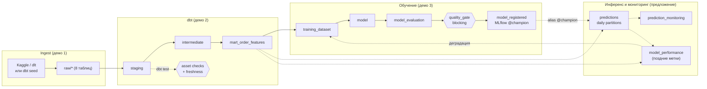

# mlinside-demo-02-dagster — описание проекта

> Статус: описание целевого состояния. Код пишется по шагам из [`.claude/PLAN.md`](../.claude/PLAN.md);
> постановка — [`.claude/PROMPT.md`](../.claude/PROMPT.md). Раздел 6 — схема обучения/инференса; п. 1 и 5 из §6.7 внесены в план (лейн L-H).

## 1. Что это

Демо-проект к лекции MLInside «Оркестрация ML-пайплайнов на Dagster» (дека
`MLInside-course/data/shared/Оркестрация_ML_пайплайнов_на_Dagster_v2.pptx`). Показывает один граф ассетов Dagster
от выгрузки сырых данных до модели в реестре MLflow. Аудитория — MLE и MLOps.

Центральная идея лекции (слайды 3–4, 37, 50): сейчас пайплайн живёт в трёх местах — dbt в CI, ноутбук, cron.
Общего графа нет ни у одного из них. Dagster становится control plane над стеком. Он ничего не вычисляет сам,
но знает, **что существует, из чего получено, когда пересчитать и что проверить**. Трансформации делает dbt,
обучение — sklearn, эксперименты и версии моделей хранит MLflow.

## 2. ML-задача

Датасет — [Olist Brazilian E-Commerce](https://www.kaggle.com/datasets/olistbr/brazilian-ecommerce), 99 441 заказ
за период 2016-09 … 2018-10.

| | |
|---|---|
| Задача | бинарная классификация: «доставленный заказ опоздает» (`is_late_delivery`) |
| Баланс | 6.8 % положительных (среди 96 476 доставленных заказов) |
| Витрина | dbt-модель `mart_order_features`: одна строка на заказ, 22 признака, **известные на момент покупки** |
| Модели | `HistGradientBoosting` (по умолчанию) или `LogisticRegression` — выбор в `TrainConfig` |
| Метрики | ROC AUC ≈ 0.78 (сплит по хешу) / ≈ 0.71 (сплит по времени), PR AUC; accuracy не показываем |
| Гейт | блокирующий `@asset_check` `quality_gate` на `model_evaluation`, порог задан в `settings` |

Подробности и риски (дрейф доли просрочек по месяцам от 0.7 % до 19 %, вклад `purchase_month`) —
[`.claude/drafts/ml/REPORT.md`](../.claude/drafts/ml/REPORT.md).

## 3. Граф ассетов

Чёрное — план этапов 1–2. Пунктир — предложение из раздела 6.

## 4. Стек: dev и prod

Код ассетов в dev и prod один и тот же. Отличаются ресурсы, `dagster.yaml` и `.env`.

| Слой | dev (ноутбук, демо) | prod |
|---|---|---|
| Хранилище данных | DuckDB-файл | ClickHouse: dbt-таргет `ch`, `ch_table_config` уже есть в каноническом dbt-проекте |
| dbt | `dbt-duckdb` | `dbt-clickhouse`; cross-db макросы через `dispatch` |
| Состояние Dagster | SQLite в `DAGSTER_HOME` (`dg dev`) | Postgres, отдельные webserver и daemon, code location (D8) |
| Executor | `in_process` (DuckDB допускает одного писателя, D7) | `multiprocess` / `k8s`, тяжёлое обучение — через Dagster Pipes |
| MLflow | `sqlite:///mlflow.db` + `./mlruns` | Postgres backend + S3/MinIO для артефактов |
| Observability | лог `dg dev` | Prometheus + Loki + Grafana; алерты в Telegram (демо 4) |
| Деплой | `make dev` | Docker Compose на VM или Dagster+ (Hybrid/Serverless), `docs/deploy/` |

## 5. Четыре демо

| # | Что показываем | Главный результат |
|---|---|---|
| 1 | `create-dagster` → `dg dev` → ingest: v1 `dbt seed`, v2 dlt из Kaggle с сэмплированием по `order_id` | raw-таблицы в DuckDB |
| 2 | `DbtProjectComponent`; раздельные `transform_job` и `dq_job`; source freshness | в UI видно, что упало: модель или проверка качества |
| 3 | витрина → обучение → оценка → гейт → реестр MLflow | один Materialize проводит данные от Kaggle до `@champion` |
| 4 | GitHub Actions, Docker Compose, Grafana-стек, алерт в Telegram | ломаем check и получаем алерт |

Инструменты курса вокруг проекта (из плана курса): Feast, DVC, FastAPI-serving, Kafka, Evidently. В этом демо
их нет намеренно — лекция про оркестрацию. Раздел 6 показывает, где они подключаются.

## 6. Периодическое обучение и постоянный инференс: как это обычно устроено

### 6.1. Три контура с разной частотой

В проде в Dagster обычно живут три контура. Они связаны через **данные и реестр моделей**, а не одним
расписанием:

| Контур | Частота | Что делает | Триггер в Dagster |
|---|---|---|---|
| **A. Обучение** | неделя или месяц | собрать выборку за окно → обучить → сравнить с текущим champion → зарегистрировать | `AutomationCondition.on_cron(...)` на `training_dataset` и ниже, плюс сенсор деградации (контур C) |
| **B. Инференс** | час или день (batch), либо онлайн | скоринг новых строк текущим `@champion` | партиционированный ассет `predictions` + `on_cron`/`eager`, либо сенсор на landing-зону |
| **C. Мониторинг** | день | дрейф признаков и предсказаний; качество, когда появились метки | ассеты-мониторы + asset checks → алерты; при деградации запускается контур A |

dbt-часть работает по своему расписанию (или `eager` от ingest). Все три контура читают одни и те же витрины.

### 6.2. Контур A — обучение

- **Окно, а не «вся таблица».** Обучающая выборка — диапазон партиций. Например, скользящие 12 месяцев
  (слайд 28: «на каких данных обучена модель»). Границы окна пишутся в теги MLflow-run и в метаданные ассета.
- **Сплит по времени.** Для временных данных holdout берут из последних периодов. Сплит по хешу, как в демо,
  завышает метрику (0.78 против 0.71 на Olist). В демо хеш-сплит оставляем ради наглядности, но
  фиксируем это в `decisions.md`, а в проде переключаем через `TrainConfig`.
- **Challenger против champion.** Новая модель не становится champion только потому, что она новее.
  `model_evaluation` считает метрики нового кандидата **и текущего `@champion` на одном и том же holdout**.
  Блокирующий гейт проверяет два условия: абсолютный порог и отсутствие регрессии относительно champion.
- **Регистрация и промоушен — разные шаги.** `model_registered` создаёт версию с алиасом `@challenger`.
  Перевод алиаса на `@champion` делается автоматически после гейта или вручную из UI (отдельная джоба `promote`).
  Откат = перевод алиаса на прошлую версию, переобучать ничего не нужно.
- **Воспроизводимость.** В тегах run'а хранятся `dataset_fingerprint` (уже в плане, D5), окно данных, git sha
  и хеш dbt-манифеста.
- **Идемпотентность.** Если fingerprint не изменился, новая версия не регистрируется (D5).
- **Тяжёлое обучение** выносится через Dagster Pipes (K8s, Spark, SageMaker). Граф остаётся в Dagster (слайд 38).

### 6.3. Контур B — инференс

**Batch — основной вариант для этого стека:**

- `predictions` партиционирован по дню покупки (`DailyPartitionsDefinition`). Одна партиция — это заказы за день,
  их признаки читаются из `mart_order_features` (или из отдельной inference-витрины без таргета).
- Модель загружается **по алиасу в момент запуска**: `mlflow.pyfunc.load_model("models:/<name>@champion")`.
  Прямой зависимости от ассета `model` в данных нет. В каждой строке результата и в метаданных партиции
  пишется `model_version`, поэтому видно, какая версия что посчитала.
- Запись идемпотентна на уровне партиции. DuckDB: `delete where day = ?` + `insert`. ClickHouse: таблица
  `PARTITION BY toYYYYMM(day)`, `ReplacingMergeTree(scored_at)` по `(order_id, model_version)` или
  `REPLACE PARTITION` из staging-таблицы. Повторный запуск партиции не создаёт дублей.
- Триггер: `AutomationCondition.eager()` (последняя партиция пересчитывается, когда обновилась её партиция в витрине)
  или `on_cron("0 * * * *")` для почасового микро-батча. Если данные приходят файлами — сенсор с курсором
  (слайд 32), который запускает ingest, а дальше цепочку ведёт `eager`.
- **Пересчёт истории после смены модели — осознанное действие.** Это бэкфилл по партициям из UI, а не побочный
  эффект переобучения. Поэтому обновление модели не должно автоматически инвалидировать все партиции `predictions`.
- Результаты лежат в той же БД, что и витрины. Дальше на них строятся dbt-модели, дашборды и мониторинг.

**Онлайн** (ответ нужен за миллисекунды, при оформлении заказа):

- Сервинг вне Dagster: FastAPI или BentoML, модель загружается по тому же алиасу `@champion` при старте
  или при смене алиаса. Признаки берутся из online store (Feast + Redis) или считаются в запросе.
- Dagster отвечает за всё, что вокруг: переобучение, промоушен, материализацию offline- и online-признаков,
  а также разбор логов инференса. Логи идут по цепочке Kafka → ClickHouse, ClickHouse читается ассетом-монитором.
- Стриминговый скоринг с задержкой меньше минуты — тоже не задача Dagster. Минимальная реальная частота
  у него — минуты.

### 6.4. Контур C — мониторинг и обратная связь

- **Дрейф без меток** (ежедневно): PSI или KS по признакам и по распределению скоров, positive rate
  предсказаний. Считается SQL-запросом по ClickHouse или через Evidently. Результат — asset checks на
  `predictions` (WARN или ERROR), они видны в UI и в Grafana.
- **Качество с поздними метками.** Опоздание становится известно только после обещанной даты доставки.
  `model_performance` партиционирован по дню покупки и материализуется с лагом, например через N дней:
  `on_cron` плюс сдвиг окна через `TimeWindowPartitionMapping(start_offset=-N, end_offset=-N)`. Он сопоставляет
  `predictions` с фактом и считает ROC AUC и PR AUC по дням.
- **Замыкание цикла.** Если check на `model_performance` падает, сенсор (`@asset_check`-статус или
  `run_status_sensor`) запускает контур A вне расписания. Итоговое правило переобучения:
  «по расписанию **или** по деградации, но не чаще X».

### 6.5. Как это ложится на Olist

Датасет исторический: новые заказы не приходят. Поток имитируется «виртуальным сегодня»:

- `SIM_TODAY` в `settings` двигается расписанием или вручную. Ingest и `predictions` видят только заказы с
  `purchase_date <= SIM_TODAY`.
- Сценарий для демо: обучаем на 2017-01 … 2017-12 и скорим 2018-01 … 2018-03 бэкфиллом по партициям.
  В феврале–марте 2018 доля просрочек вырастает до 19 %: `model_performance` краснеет, приходит алерт,
  запускается переобучение. На реальных данных виден весь цикл, и ничего не пришлось подкручивать.

### 6.6. Типичные ошибки

- Обучение внутри инференс-запуска («каждый раз переобучим на всём»).
- Загрузка «последней версии» вместо алиаса, прошедшего гейт.
- Случайный сплит на временных данных и отсутствие сравнения с champion.
- Append без ключа в `predictions`: при каждом ретрае появляются дубли.
- Скрытая инвалидизация истории при смене модели вместо явного бэкфилла.
- Тяжёлое обучение в процессе code location вместо Pipes.

### 6.7. Что добавить в план (кандидаты, не решено)

1. `defs/ml/inference.py`: `predictions` (daily partitions, загрузка модели по алиасу, идемпотентная запись по
   партиции) и `prediction_monitoring` с checks на positive rate и PSI.
2. `model_performance` с лагом по партициям, плюс сенсор «деградация → `ml_job`».
3. `TrainConfig.split = hash | time` и окно обучения в партициях; сравнение с champion в `model_evaluation`.
4. Алиасы `@challenger` / `@champion` и джоба `promote`.
5. `SIM_TODAY` для имитации потока на историческом датасете.
6. Для prod — dbt-таргет `ch` и `ClickHouseResource` с тем же интерфейсом, что у `DuckDBResource`.

Пункты 1 и 5 внесены в план как лейн **L-H** ([`.claude/PLAN.md` §6](../.claude/PLAN.md)): слайд 37 уже рисует
`predictions → monitoring`, а в демо этого узла не было. Остальные пункты — после лекции.
